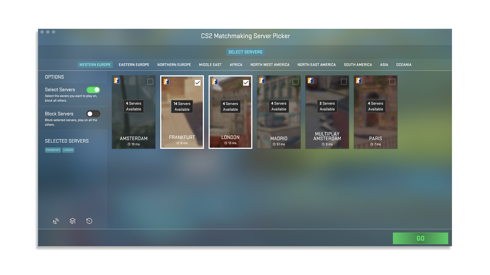

<p align="center">
    
</p>

<h1 align="center">
Counter Strike 2 Matchmaking Server Picker
</h1>

<p align="center"><strong>Pick and block official Counter Strike 2 matchmaking servers. You decide where you want to play.</strong></p>

<div align="center">


<a href="https://buymeacoffee.com/simonsagstd">


</a>

</div>

<small>

## Summary

</small>

This is an electronjs powered windows application which can block connections to official Counter Strike 2 matchmaking server relays. Thus you can play on the server with the best ping or on your preferred location. This app does not interfere in any way with the Counter Strike 2 game itself so it is safe to use. The design is inspired by the current Panorama UI.

## Table of Contents

-   [Features](#features)
-   [Setup](#setup)
-   [Credits](#credits)
-   [Contributing](#contributing)
-   [License](#license)

## Features

-   Relays are always up to date - fetches all available relays via steam api and sorts them into the right regions by geolocation
-   CS2 Panorama UI inspired design and layout - easy to use and understand
-   Block Mode - Select servers you want to block and play on all others
-   Select Mode - Select servers you want to play on and block all others
-   Compare server ping times and refresh them any time

<small>

> Important Note: The Steam API does only provide information on the server relays and their location. The real IPs wont be revealed due this would be a serious security vulnerability. So there is no 100% guarantee that this blocker will always work and there wont be any tool out there which can do this - its simply impossible. But most of the time blocking in and outgoing tcp and upd connections from the relay ip addresses and their port range wil do the job! That is also what this tool is doing under the hood and it works at least 9/10 times.

</small>

## Setup

_Tested with Node v20.18.1_

Clone the repository

```bash
git clone https://github.com/<yourname>/<yourforkedrepo>.git
```

Navigate to project directory

```bash
cd cs2-mm-server-picker
```

Install all dependencies

```bash
npm install
```

For development

```bash
npm run start
```

Build

```bash
npm run build
```

Compile

```bash
npm run compile

// You can change the electron builder configuration inside electron-builder.mjs
```

### API

Im using the Steam API [GetSDRConfig](https://api.steampowered.com/ISteamApps/GetSDRConfig/v1?appid=730).

## Credits

-   Thanks to [cawa-93](https://github.com/cawa-93) for his [vite-electron-builder](https://github.com/cawa-93/vite-electron-builder) boiler template - [buy him a coffee!](https://buymeacoffee.com/kozack)

## Contributing

Contributions are welcome! Please see into [CONTRIBUTING.md](CONTRIBUTING.md) for details on the code of conduct and submission process.

### Contributors

<table>
  <tbody>
    <tr>
      <td align="center" style="border: 1px solid transparent"><a href="https://github.com/simonsagstetter"><br /><sub><b>simonsagstetter</b></sub></a></td>
    </tr>
  </tbody>
</table>

## License

This project is licensed under the MIT License - see the [LICENSE](LICENSE) file for details
