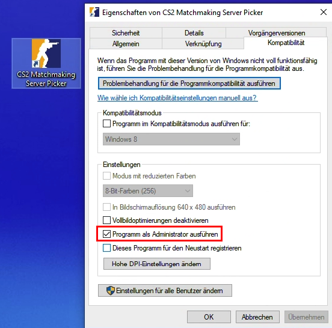

<p align="center">
    
</p>

<h1 align="center">
Counter Strike 2 Matchmaking Server Picker
</h1>

<p align="center"><strong>Pick and block official Counter-Strike 2 matchmaking servers. Take control and decide where you want to play.</strong></p>

<div align="center">


<a href="https://buymeacoffee.com/simonsagstd">


</a>

</div>

<small>

## Summary

</small>

This is a Windows application powered by Electron.js that allows you to block connections to official Counter-Strike 2 matchmaking server relays. This way, you can play on the server with the best ping or at your preferred location. The app does not interfere with the Counter-Strike 2 game itself, making it safe to use. Its design is inspired by the current Panorama UI.

## Table of Contents

-   [Features](#features)
-   [Installation](#installation)
-   [Usage](#usage)
-   [Setup](#setup)
-   [Credits](#credits)
-   [Contributing](#contributing)
-   [License](#license)

## Features

-   Always up-to-date relay list — fetches all available relays via the Steam API and assigns them to the correct regions using geolocation
-   CS2 Panorama UI-inspired design and layout — easy to use and understand
-   Block Mode — select servers you want to block and play on all others
-   Select Mode — select servers you want to play on and block all others
-   Compare server ping times and refresh them at any time

<small>

> Important Note: The Steam API only provides information about the server relays and their locations. The actual IP addresses of the game servers are not revealed, as this would pose a serious security risk. Therefore, there is no 100% guarantee that this blocker will always work, and no tool can offer complete reliability — it’s simply impossible. However, most of the time, blocking incoming and outgoing TCP and UDP connections from the relay IP addresses and their port ranges will do the job. That’s exactly what this tool does under the hood, and it works in at least 9 out of 10 cases.

</small>

## Installation

[Download the latest release here](https://github.com/simonsagstetter/cs2-mm-server-picker/releases)

Choose the ia32 installer if you are running a 32-bit version of Windows, or the x64 installer if you are using a 64-bit version. If you are unsure, select the installer without a postfix (the one ending with `...win.exe`).

The executable is a one-click installer, and the app will launch automatically once the installation is complete.

> Important: Since the application executes `netsh` commands to add firewall rules, it requires administrative privileges. If you don’t want to confirm a user privilege elevation every time you block or unblock servers, you should run the app as an administrator.
> You can also set it to always run as administrator by right-clicking the app icon, selecting Properties, going to the Compatibility tab, and checking Run this program as an administrator.

<p align="center">
    
</p>

## Setup

_Tested with Node v20.18.1_

Clone the repository

```bash
git clone https://github.com/<yourname>/<yourforkedrepo>.git
```

Navigate to project directory

```bash
cd cs2-mm-server-picker
```

Install all dependencies

```bash
npm install
```

For development

```bash
npm run start
```

Build

```bash
npm run build
```

Compile

```bash
npm run compile

// You can change the electron builder configuration inside electron-builder.mjs
```

### API

Im using the Steam API [GetSDRConfig](https://api.steampowered.com/ISteamApps/GetSDRConfig/v1?appid=730).

## Credits

-   Thanks to [cawa-93](https://github.com/cawa-93) for his [vite-electron-builder](https://github.com/cawa-93/vite-electron-builder) boiler template - [buy him a coffee!](https://buymeacoffee.com/kozack)

## Contributing

Contributions are welcome! Please see into [CONTRIBUTING.md](CONTRIBUTING.md) for details on the code of conduct and submission process.

### Contributors

<table>
  <tbody>
    <tr>
      <td align="center" style="border: 1px solid transparent"><a href="https://github.com/simonsagstetter"><br /><sub><b>simonsagstetter</b></sub></a></td>
    </tr>
  </tbody>
</table>

## License

This project is licensed under the MIT License - see the [LICENSE](LICENSE) file for details
